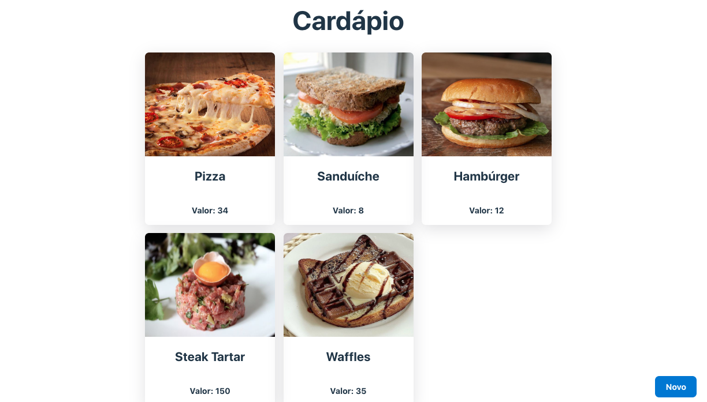
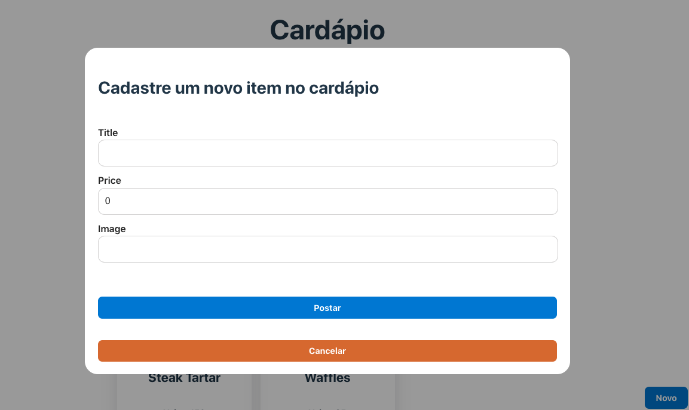

# Projeto Fullstack

### Projeto fullstack feito com o uso React/TypeScript como front-end e Express, MongoDB, Spring e H2 Database como back-end.

## Front-end (React e TypeScript) 
### [Pasta: cardapio-front](./cardapio-front/)

### Para buscar os dados e postar novos, a nossa interface pode se comunicar com diferentes implementações no back-end. A seguir está apresentado uma com Spring e H2 Database e outra com Express e MongoDB.

## Back-end (Spring e H2 Database)
### [Pasta: cardapio](./cardapio/)

## Back-end (Express e MongoDB)
### [Pasta: cardapio-express](./cardapio-express/)